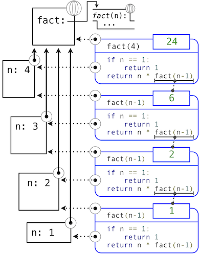
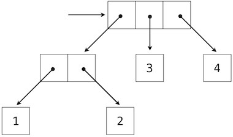

# 递归
## 递归函数
如果函数的函数体直接或者间接自己调用自己，那么这个函数是递归的。

递归函数的执行过程可能需要再次调用这个函数。Python 中的递归函数不需要任何特殊的语法，但是它们的确需要一些注意来正确定义。

作为递归函数的介绍，我们以将英文单词转换为它的 Pig Latin 等价形式开始。Pig Latin 是一种隐语：对英文单词使用一种简单、确定的转换来掩盖单词的含义。Thomas Jefferson 据推测是先行者。英文单词的 Pig Latin 等价形式将辅音前缀（可能为空）从开头移动到末尾，并且添加-ay元音。所以，pun会变成unpay，stout会变成outstay，all会变成allay。
```bash
>>> def pig_latin(w):
        """Return the Pig Latin equivalent of English word w."""
        if starts_with_a_vowel(w):
            return w + 'ay'
        return pig_latin(w[1:] + w[0])
>>> def starts_with_a_vowel(w):
        """Return whether w begins with a vowel."""
        return w[0].lower() in 'aeiou'
```
这个定义背后的想法是，一个以辅音开头的字符串的 Pig Latin 变体和另一个字符串的 Pig Latin 变体相同：它通过将第一个字母移到末尾来创建。于是，sending的 Pig Latin 变体就和endings的变体（endingsay）相同。smother的 Pig Latin 变体和mothers的变体（othersmay）相同。而且，将辅音从开头移动到末尾会产生带有更少辅音前缀的更简单的问题。在sending的例子中，将s移动到末尾会产生以元音开头的单词。

即使pig_latin函数在它的函数体中调用，pig_latin的定义是完整且正确的。
```bash
>>> pig_latin('pun')
'unpay'
```
我们能够准确理解递归函数如何使用我们的计算环境模型来成功调用。环境的图示和描述pig_latin('pun')求值的表达式树展示在下面：


Python 求值过程的步骤产生如下结果：
- 1.pig_latin的def语句 被执行，其中：
   - 使用函数体创建新的pig_latin函数对象，并且
   - 将名称pig_latin在当前（全局）帧中绑定到这个函数上。
- 2.starts_with_a_vowel的def语句类似地执行。
- 3.求出pig_latin('pun')的调用表达式，通过
   - 求出运算符和操作数子表达式，通过
       - 查找绑定到pig_latin函数的pig_latin名称
       - 对字符串对象'pun'求出操作数字符串字面值
   - 在参数'pun'上调用pig_latin函数，通过
       - 添加扩展自全局帧的局部帧
       - 将形参w绑定到当前帧的实参'pun'上。
       - 在以当前帧起始的环境中执行pig_latin的函数体
         - 最开始的条件语句没有效果，因为头部表达式求值为False
         - 求出最后的返回表达式pig_latin(w[1:] + w[0])，通过
            - 查找绑定到pig_latin函数的pig_latin名称
            - 对字符串对象'pun'求出操作数表达式
            - 在参数'unp'上调用pig_latin，它会从pig_latin函数体中的条件语句组返回预期结果。

就像这个例子所展示的那样，虽然递归函数具有循环特征，他仍旧正确调用。pig_latin函数调用了两次，但是每次都带有不同的参数。虽然第二个调用来自pig_latin自己的函数体，但由名称查找函数会成功，因为名称pig_latin在它的函数体执行前的环境中绑定。

这个例子也展示了 Python 的递归函数的求值过程如何与递归函数交互，来产生带有许多嵌套步骤的复杂计算过程，即使函数定义本身可能包含非常少的代码行数。
## 剖析递归函数
许多递归函数的函数体中都存在通用模式。函数体以基本条件开始，它是一个条件语句，为需要处理的最简单的输入定义函数行为。在pig_latin的例子中，基本条件对任何以元音开头的单词成立。这个时候，只需要返回末尾附加ay的参数。一些递归函数会有多重基本条件。

基本条件之后是一个或多个递归调用。递归调用有特定的特征：它们必须简化原始问题。在pig_latin的例子中，w中最开始辅音越多，就需要越多的处理工作。在递归调用pig_latin(w[1:] + w[0])中，我们在一个具有更少初始辅音的单词上调用pig_latin -- 这就是更简化的问题。每个成功的pig_latin调用都会更加简化，直到满足了基本条件：一个没有初始辅音的单词。

递归调用通过逐步简化问题来表达计算。与我们在过去使用过的迭代方式相比，它们通常以不同方式来解决问题。考虑用于计算n的阶乘的函数fact，其中fact(4)计算了4! = 4·3·2·1 = 24。

使用while语句的自然实现会通过将每个截至n的正数相乘来求出结果。
```bash
>>> def fact_iter(n):
        total, k = 1, 1
        while k <= n:
            total, k = total * k, k + 1
        return total
>>> fact_iter(4)
24
```
另一方面，阶乘的递归实现可以以fact(n-1)（一个更简单的问题）来表示fact(n)。递归的基本条件是问题的最简形式：fact(1)是1。
```bash
>>> def fact(n):
        if n == 1:
            return 1
        return n * fact(n-1)
>>> fact(4)
24
```
函数的正确性可以轻易通过阶乘函数的标准数学定义来验证。
```bash
(n − 1)! = (n − 1)·(n − 2)· ... · 1
n！ = n·(n − 1)·(n − 2)· ... · 1
n! = n·(n − 1)!
```
这两个阶乘函数在概念上不同。迭代的函数通过将每个式子，从基本条件1到最终的总数逐步相乘来构造结果。另一方面，递归函数直接从最终的式子n和简化的问题fact(n-1)构造结果。

将fact函数应用于更简单的问题实例，来展开递归的同时，结果最终由基本条件构建。下面的图示展示了递归如何向fact传入1而终止，以及每个调用的结果如何依赖于下一个调用，直到满足了基本条件。



虽然我们可以使用我们的计算模型展开递归，通常把递归调用看做函数抽象更清晰一些。也就是说，我们不应该关心fact(n-1)如何在fact的函数体中实现；我们只需要相信它计算了n-1的阶乘。将递归调用看做函数抽象叫做递归的“信仰飞跃”（leap of faith）。我们以函数自身来定义函数，但是仅仅相信更简单的情况在验证函数正确性时会正常工作。这个例子中我们相信，fact(n-1)会正确计算(n-1)!；我们只需要检查，如果满足假设n!是否正确计算。这样，递归函数正确性的验证就变成了一种归纳证明。

函数fact_iter和fact也不一样，因为前者必须引入两个额外的名称，total和k，它们在递归实现中并不需要。通常，迭代函数必须维护一些局部状态，它们会在计算过程中改变。在任何迭代的时间点上，状态刻画了已完成的结果，以及未完成的工作总量。例如，当k为3且total为2时，就还剩下两个式子没有处理，3和4。另一方面，fact由单一参数n来刻画。计算的状态完全包含在表达式树的结果中，它的返回值起到total的作用，并且在不同的帧中将n绑定到不同的值上，而不是显式跟踪k。

递归函数可以更加依赖于解释器本身，通过将计算状态储存为表达式树和环境的一部分，而不是显式使用局部帧中的名称。出于这个原因，递归函数通常易于定义，因为我们不需要试着弄清必须在迭代中维护的局部状态。另一方面，学会弄清由递归函数实现的计算过程，需要一些练习。
## 树形递归
另一个递归的普遍模式叫做树形递归。例如，考虑斐波那契序列的计算，其中每个数值都是前两个的和。
```bash
>>> def fib(n):
        if n == 1:
            return 0
        if n == 2:
            return 1
        return fib(n-2) + fib(n-1)
>>> fib(6)
5
```
这个递归定义和我们之前的尝试有很大关系：它准确反映了斐波那契数的相似定义。考虑求出fib(6)所产生的计算模式，它展示在下面。为了计算fib(6)，我们需要计算fib(5)和fib(4)。为了计算fib(5)，我们需要计算fib(4)和fib(3)。通常，这个演化过程看起来像一棵树（下面的图并不是完整的表达式树，而是简化的过程描述；一个完整的表达式树也拥有同样的结构）。在遍历这棵树的过程中，每个蓝点都表示斐波那契数的已完成计算。


调用自身多次的函数叫做树形递归。以树形递归为原型编写的函数十分有用，但是用于计算斐波那契数则非常糟糕，因为它做了很多重复的计算。要注意整个fib(4)的计算是重复的，它几乎是一半的工作量。实际上，不难得出函数用于计算fib(1)和fib(2)（通常是树中的叶子数量）的时间是fib(n+1)。为了弄清楚这有多糟糕，我们可以证明fib(n)的值随着n以指数方式增长。所以，这个过程的步骤数量随输入以指数方式增长。

已经见过斐波那契数的迭代实现，出于便利在这里贴出来：
```bash
>>> def fib_iter(n):
        prev, curr = 1, 0  # curr is the first Fibonacci number.
        for _ in range(n-1):
             prev, curr = curr, prev + curr
        return curr
```
这里我们必须维护的状态由当前值和上一个斐波那契数组成。for语句也显式跟踪了迭代数量。这个定义并没有像递归方式那样清晰反映斐波那契数的数学定义。但是，迭代实现中所需的计算总数只是线性，而不是指数于n的。甚至对于n的较小值，这个差异都非常大。

然而我们不应该从这个差异总结出，树形递归的过程是没有用的。当我们考虑层次数据结构，而不是数值上的操作时，我们发现树形递归是自然而强大的工具。而且，树形过程可以变得更高效。

**记忆。**用于提升重复计算的递归函数效率的机制叫做记忆。记忆函数会为任何之前接受的参数储存返回值。fib(4)的第二次调用不会执行与第一次同样的复杂过程，而是直接返回第一次调用的已储存结果。

记忆函数可以自然表达为高阶函数，也可以用作装饰器。下面的定义为之前的已计算结果创建缓存，由被计算的参数索引。在这个实现中，这个字典的使用需要记忆函数的参数是不可变的。
```bash
>>> def memo(f):
        """Return a memoized version of single-argument function f."""
        cache = {}
        def memoized(n):
            if n not in cache:
                cache[n] = f(n)
            return cache[n]
        return memoized
>>> fib = memo(fib)
>>> fib(40)
63245986
```
由记忆函数节省的所需的计算时间总数在这个例子中是巨大的。被记忆的递归函数fib和迭代函数fib_iter都只需要线性于输入n的时间总数。为了计算fib(40)，fib的函数体只执行 40 次，而不是无记忆递归中的 102,334,155 次。

**空间。**为了理解函数所需的空间，我们必须在我们的计算模型中规定内存如何使用，保留和回收。在求解表达式过程中，我们必须保留所有活动环境和所有这些环境引用的值和帧。如果环境为表达式树当前分支中的一些表达式提供求值上下文，那么它就是活动环境。

例如，当求值fib时，解释器按序计算之前的每个值，遍历树形结构。为了这样做，它只需要在计算的任何时间点，跟踪树中在当前节点之前的那些节点。用于求出剩余节点的内存可以被回收，因为它不会影响未来的计算。通常，树形递归所需空间与树的深度成正比。

下面的图示描述了由求解fib(3)生成的表达式树。在求解fib最初调用的返回表达式的过程中，fib(n-2)被求值，产生值0。一旦这个值计算出来，对应的环境帧（标为灰色）就不再需要了：它并不是活动环境的一部分。所以，一个设计良好的解释器会回收用于储存这个帧的内存。另一方面，如果解释器当前正在求解fib(n-1)，那么由这次fib调用（其中n为2）创建的环境是活动的。与之对应，最开始在3上调用fib所创建的环境也是活动的，因为这个值还没有成功计算出来。


在memo的例子中，只要一些名称绑定到了活动环境中的某个函数上，关联到所返回函数（它包含cache）的环境必须保留。cache字典中的条目数量随传递给fib的唯一参数数量线性增长，它的规模线性于输入。另一方面，迭代实现只需要两个数值来在计算过程中跟踪：prev和curr，所以是常数大小。

我们使用记忆函数的例子展示了编程中的通用模式，即通常可以通过增加所用空间来减少计算时间，反之亦然。
## 示例：找零
考虑下面这个问题：如果给你半美元、四分之一美元、十美分、五美分和一美分，一美元有多少种找零的方式？更通常来说，我们能不能编写一个函数，使用一系列货币的面额，计算有多少种方式为给定的金额总数找零？

这个问题可以用递归函数简单解决。假设我们认为可用的硬币类型以某种顺序排列，假设从大到小排列。

使用n种硬币找零的方式为：
- 使用所有除了第一种之外的硬币为a找零的方式
- 使用n种硬币为更小的金额a - d找零的方式，其中d是第一种硬币的面额。

为了弄清楚为什么这是正确的，可以看出，找零方式可以分为两组，不使用第一种硬币的方式，和使用它们的方式。所以，找零方式的总数等于不使用第一种硬币为该金额找零的方式数量，加上使用第一种硬币至少一次的方式数量。而后者的数量等于在使用第一种硬币之后，为剩余的金额找零的方式数量。

因此，我们可以递归将给定金额的找零问题，归约为使用更少种类的硬币为更小的金额找零的问题。仔细考虑这个归约原则，并且说服自己，如果我们规定了下列基本条件，我们就可以使用它来描述算法：
- 如果a正好是零，那么有一种找零方式。
- 如果a小于零，那么有零种找零方式。
- 如果n小于零，那么有零种找零方式。

我们可以轻易将这个描述翻译成递归函数：
```bash
>>> def count_change(a, kinds=(50, 25, 10, 5, 1)):
        """Return the number of ways to change amount a using coin kinds."""
        if a == 0:
            return 1
        if a < 0 or len(kinds) == 0:
            return 0
        d = kinds[0]
        return count_change(a, kinds[1:]) + count_change(a - d, kinds)
>>> count_change(100)
292
```
count_change函数生成树形递归过程，和fib的首个实现一样，它是重复的。它会花费很长时间来计算出292，除非我们记忆这个函数。另一方面，设计迭代算法来计算出结果的方式并不是那么明显，我们将它留做一个挑战。
## 增长度
前面的例子表明，不同过程在花费的时间和空间计算资源上有显著差异。我们用于描述这个差异的便捷方式，就是使用增长度的概念，来获得当输入变得更大时，过程所需资源的大致度量。

令n为度量问题规模的参数，R(n)为处理规模为n的问题的过程所需的资源总数。在我们前面的例子中，我们将n看做给定函数所要计算出的数值。但是还有其他可能。例如，如果我们的目标是计算某个数值的平方根近似值，我们会将n看做所需的有效位数的数量。通常，有一些问题相关的特性可用于分析给定的过程。与之相似，R(n)可用于度量所用的内存总数，所执行的基本的机器操作数量，以及其它。在一次只执行固定数量操作的计算中，用于求解表达式的所需时间，与求值过程中执行的基本机器操作数量成正比。

我们说，R(n)具有Θ(f(n))的增长度，写作R(n)=Θ(f(n))（读作“theta f(n)”），如果存在独立于n的常数k1和k2，那么对于任何足够大的n值：
```bash
k1·f(n) <= R(n) <= k2·f(n)
```
也就是说，对于较大的n，R(n)的值夹在两个具有f(n)规模的值之间：
- 下界k1·f(n)
- 上界k2·f(n)

例如，计算n!所需的步骤数量与n成正比，所以这个过程的所需步骤以Θ(n)增长。我们也看到了，递归实现fact的所需空间以Θ(n)增长。与之相反，迭代实现fact_iter花费相似的步骤数量，但是所需的空间保持不变。这里，我们说这个空间以Θ(1)增长。

我们的树形递归的斐波那契数计算函数fib的步骤数量，随输入n指数增长。尤其是，我们可以发现，第 n 个斐波那契数是距离φ^(n-2)/√5的最近整数，其中φ是黄金比例：
```bash
φ = (1 + √5)/2 ≈ 1.6180
```
步骤数量随返回值增长而增长，所以树形递归过程需要Θ(φ^n)的步骤，它的一个随n指数增长的函数。

增长度只提供了过程行为的大致描述。例如，需要n^2个步骤的过程和需要1000·n^2个步骤的过程，以及需要3·n^2+10·n+17个步骤的过程都拥有Θ(n^2)的增长度。在特定的情况下，增长度的分析过于粗略，不能在函数的两个可能实现中做出判断。

但是，增长度提供了实用的方法，来表示在改变问题规模的时候，我们应如何预期过程行为的改变。对于Θ(n)（线性）的过程，使规模加倍只会使所需的资源总数加倍。对于指数的过程，每一点问题规模的增长都会使所用资源以固定因数翻倍。接下来的例子展示了一个增长度为对数的算法，所以使问题规模加倍，只会使所需资源以固定总数增加。
## 处理递归列表
递归列表结构将列表表示为首个元素和列表的剩余部分的组合。我们之前使用函数实现了递归列表，但是现在我们可以使用类来重新实现。下面，长度（__len__）和元素选择（__getitem__）被重写来展示处理递归列表的典型模式。
```bash
>>> class Rlist(object):
        """A recursive list consisting of a first element and the rest."""
        class EmptyList(object):
            def __len__(self):
                return 0
        empty = EmptyList()
        def __init__(self, first, rest=empty):
            self.first = first
            self.rest = rest
        def __repr__(self):
            args = repr(self.first)
            if self.rest is not Rlist.empty:
                args += ', {0}'.format(repr(self.rest))
            return 'Rlist({0})'.format(args)
        def __len__(self):
            return 1 + len(self.rest)
        def __getitem__(self, i):
            if i == 0:
                return self.first
            return self.rest[i-1]
```
__len__和__getitem__的定义实际上是递归的，虽然不是那么明显。Python 内建函数len在自定义对象的参数上调用时会寻找叫做__len__的方法。与之类似，下标运算符会寻找叫做__getitem__的方法。于是，这些定义最后会调用对象自身。剩余部分上的递归调用是递归列表处理的普遍模式。这个递归列表的类定义与 Python 的内建序列和打印操作能够合理交互。
```bash
>>> s = Rlist(1, Rlist(2, Rlist(3)))
>>> s.rest
Rlist(2, Rlist(3))
>>> len(s)
3
>>> s[1]
2
```
创建新列表的操作能够直接使用递归来表示。例如，我们可以定义extend_rlist函数，它接受两个递归列表作为参数并将二者的元素组合到新列表中。
```bash
>>> def extend_rlist(s1, s2):
        if s1 is Rlist.empty:
            return s2
        return Rlist(s1.first, extend_rlist(s1.rest, s2))
>>> extend_rlist(s.rest, s)
Rlist(2, Rlist(3, Rlist(1, Rlist(2, Rlist(3)))))
```
与之类似，在递归列表上映射函数展示了相似的模式：
```bash
>>> def map_rlist(s, fn):
        if s is Rlist.empty:
            return s
        return Rlist(fn(s.first), map_rlist(s.rest, fn))
>>> map_rlist(s, square)
Rlist(1, Rlist(4, Rlist(9)))
```
过滤操作包括额外的条件语句，但是也拥有相似的递归结构。
```bash
>>> def filter_rlist(s, fn):
        if s is Rlist.empty:
            return s
        rest = filter_rlist(s.rest, fn)
        if fn(s.first):
            return Rlist(s.first, rest)
        return rest
>>> filter_rlist(s, lambda x: x % 2 == 1)
Rlist(1, Rlist(3))
```
列表操作的递归实现通常不需要局部赋值或者while语句。反之，递归列表可以作为函数调用的结果来拆分和构造。所以，它们拥有步骤数量和所需空间的线性增长度。
## 层次结构
层次结构产生于数据的封闭特性，例如，元组可以包含其它元组。考虑这个数值1到4的嵌套表示。
```bash
>>> ((1, 2), 3, 4)
((1, 2), 3, 4)
```
这个元组是个长度为 3 的序列，它的第一个元素也是一个元组。这个嵌套结构的盒子和指针的图示表明，它可以看做拥有四个叶子的树，每个叶子都是一个数值。



在树中，每个子树本身都是一棵树。作为基本条件，任何本身不是元组的元素都是一个简单的树，没有任何枝干。也就是说，所有数值都是树，就像在偶对(1, 2)和整个结构中那样。

递归是用于处理树形结构的自然工具，因为我们通常可以将树的操作降至枝干的操作，它会相应产生枝干的枝干的操作，以此类推，直到我们到达了树的叶子。例如，我们可以实现count_leaves函数，它返回树的叶子总数。
```bash
>>> t = ((1, 2), 3, 4)
>>> count_leaves(t)
4
>>> big_tree = ((t, t), 5)
>>> big_tree
((((1, 2), 3, 4), ((1, 2), 3, 4)), 5)
>>> count_leaves(big_tree)
9
```
正如map是用于处理序列的强大工具，映射和递归一起为树的操作提供了强大而通用的计算形式。例如，我们可以使用高阶递归函数map_tree将树的每个叶子平方，它的结构类似于count_leaves。
```bash
>>> def map_tree(tree, fn):
        if type(tree) != tuple:
            return fn(tree)
        return tuple(map_tree(branch, fn) for branch in tree)
>>> map_tree(big_tree, square)
((((1, 4), 9, 16), ((1, 4), 9, 16)), 25)
```
内部值。上面描述的树只在叶子上存在值。另一个通用的树形结构表示也在树的内部节点上存在值。我们使用类来表示这种树。
```bash
>>> class Tree(object):
        def __init__(self, entry, left=None, right=None):
            self.entry = entry
            self.left = left
            self.right = right
        def __repr__(self):
            args = repr(self.entry)
            if self.left or self.right:
                args += ', {0}, {1}'.format(repr(self.left), repr(self.right))
            return 'Tree({0})'.format(args)
```
例如，Tree类可以为fib的递归实现表示表达式树中计算的值。fib函数用于计算斐波那契数。下面的函数fib_tree(n)返回Tree，它将第 n 个斐波那契树作为entry，并将所有之前计算出来的斐波那契数存入它的枝干中。
```bash
>>> def fib_tree(n):
        """Return a Tree that represents a recursive Fibonacci calculation."""
        if n == 1:
            return Tree(0)
        if n == 2:
            return Tree(1)
        left = fib_tree(n-2)
        right = fib_tree(n-1)
        return Tree(left.entry + right.entry, left, right)
>>> fib_tree(5)
Tree(3, Tree(1, Tree(0), Tree(1)), Tree(2, Tree(1), Tree(1, Tree(0), Tree(1))))
```
这个例子表明，表达式树可以使用树形结构编程表示。嵌套表达式和树形数据结构的联系，在我们这一章稍后对解释器设计的讨论中起到核心作用。