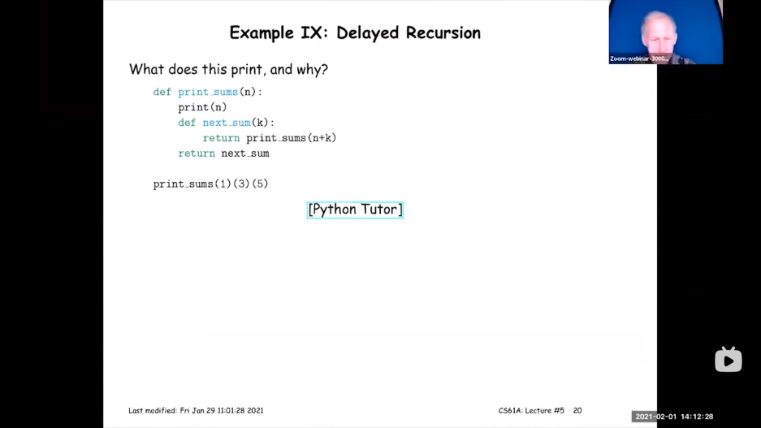
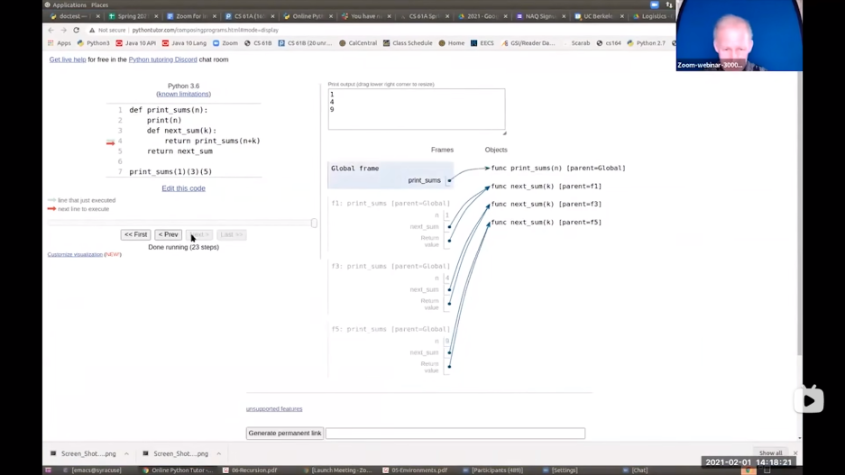
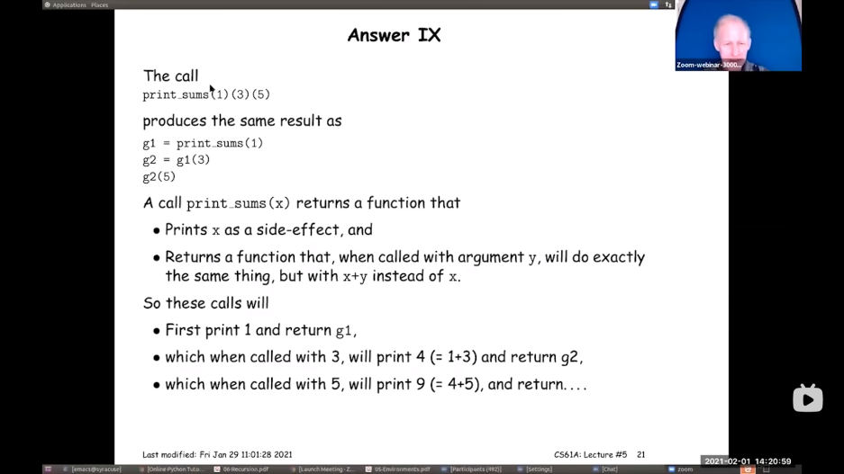
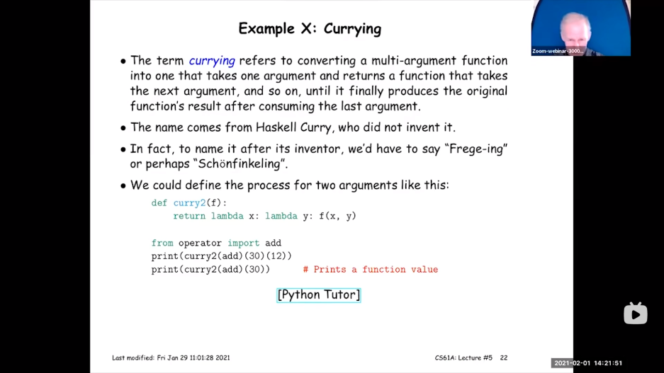

# 递归
这个程序的输出是什么？

我们首先定义了print_sums( )，使得我们可以得到print sum。

当n=1，得到print sum 1，把函数作为print sum 1返回。

当k=3，print（3+1）即 print sum 4 作为结果返回。

当k=5，print（4+5）print sum 9。
最后结果 print sum 9。

:::tip
中间结果不可见（正常运行时候，是看不见的）
:::
**具体过程**（下图为老师的讲解过程，上述为我的文字描述）

个值在当前框架中没有定义，如果他在父框架中有定义，可以使用它！！！

每次我们得到一个框架，他的父框架是全局的，因为他来自print sum（这边☞的是箭头的方向）

**另一种解释：**

其实就是我做的文字叙述差不多，只不过是英文版的。
## Curry 函数柯里化

print （curry2(add)(30)(12)）的意思是：

1.当前函数应用于30，然后函数应用于12。

2.curry2(add)有点像把add函数第一个参数设置成30。

我们在上面有一个以x为参数返回另一个以y为参数的函数。

当curry2(add)(30)(12)时候，我们可以得到30+12的结果42

当curry2(add)(30)，我们将会得到一个函数 。
**过程解释：**
