# VS Code Debug Python
```python
def jiecheng1(x):
    if(x == 1):
        return 1
    else:
        return x * jiecheng1(x-1)

def jiecheng2(x):
    ans = 1
    while(x != 1):
        ans = ans * x
        x = x - 1
    return ans

x = 10
y = 100
z = 1000
while(x):
    print(x)
    x = x - 1

print(jiecheng1(5))
print(jiecheng2(5))
```
## 调试第一步：设置断点
### 方法一
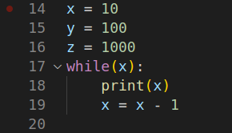

鼠标放在想要插入断点的行号左边，会出现红点，点击

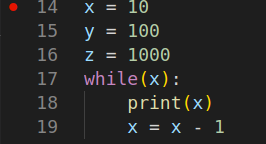

出现实心红点即为断点

### 方法二
鼠标点击所要插入断点的行，按F9

### 取消断点
在点一下小红点或按F9

## 调试第二步：开始调试
### 方法一
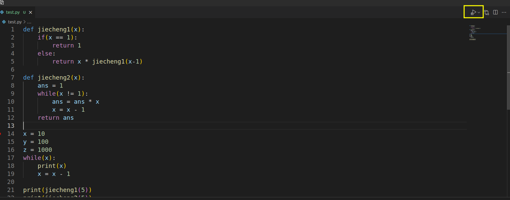
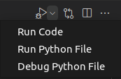

点击右上角的小箭头，点击Debug Python File即可开始调试

### 方法二
按F5

## 调试第三步：调试中注意的点


上位调试开始的图
### 快捷工具栏


具体功能如下，以从左到右的顺序
### 继续(F5)
直接运行到下一个断点处，若没有下一个断点那么直接运行完整段代码

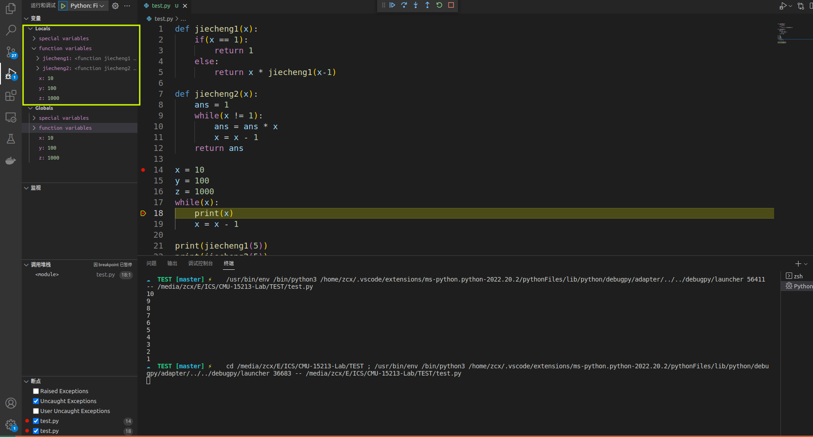

使用“继续(F5)”，可以看到在左边的“变量”栏里出现了已有的变量以及函数

### 单步跳过(F10)
单步运行代码

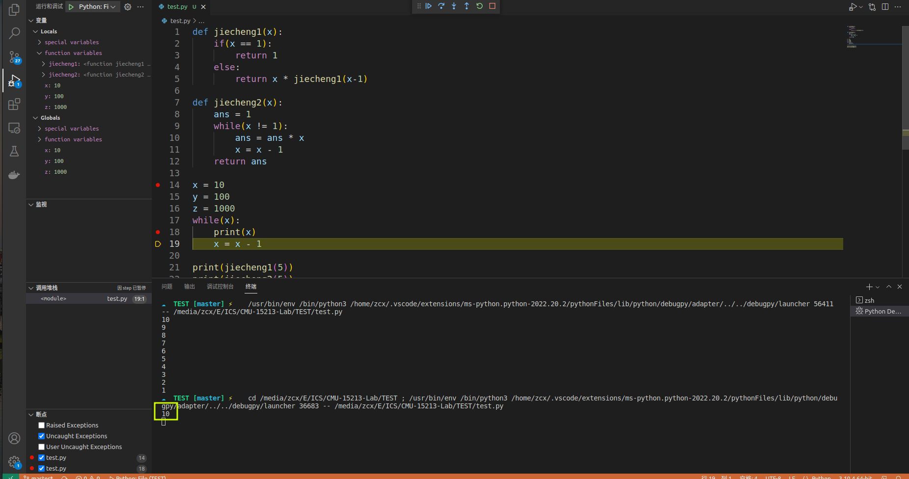

此时运行了print(x)代码，可以在下面的命令行中看到输出了10

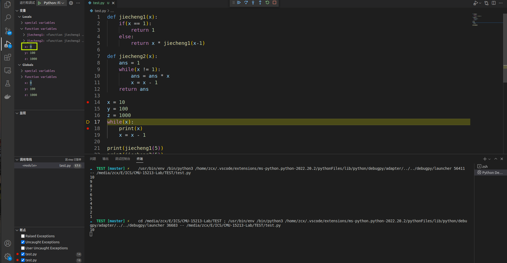
再次单步跳过，此时运行了x = x - 1,可以看到左上角的x的值变为了9

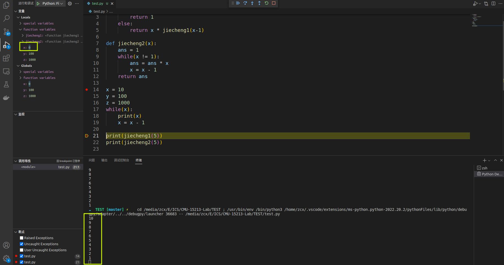
取消18行的断点，并在21行添加新的断点，使用“继续(F5)”，到达21行，可以看到此时x为0，且命令行输出了10~1

### 单步调试(F11)
进入到该行代码对应的函数内部

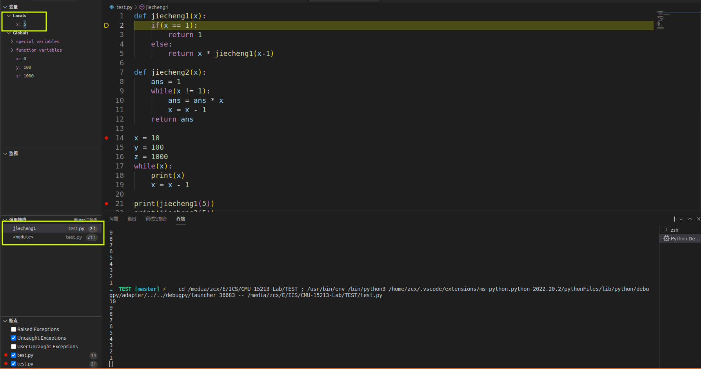

使用“单步调试(F11)”，进入了"jiecheng1"的函数内部，可以看到此时的局部变量x=5，而全局变量不变，函数堆栈增加了"jiecheng1"

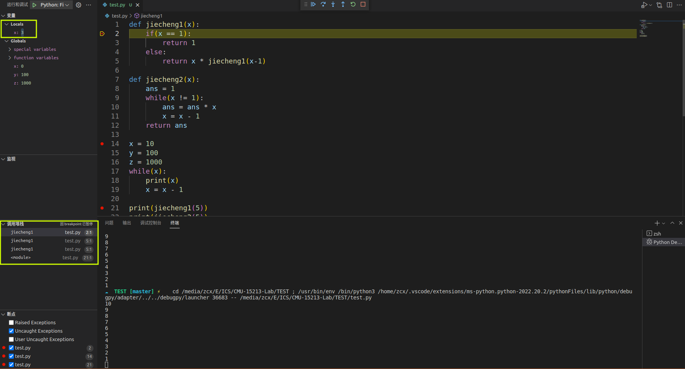

在第二行设置断点，运行两次“继续”，此时变量x=3，函数栈新增两个"jiecheng1"(可以通过调试来了解递归)

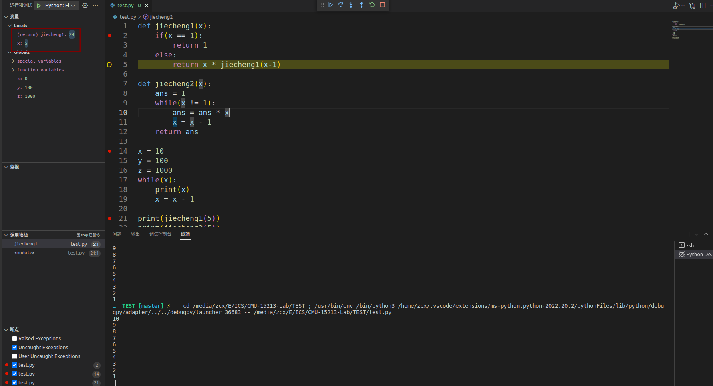

经过了多次“单步跳过(F10)”后，如图所示。

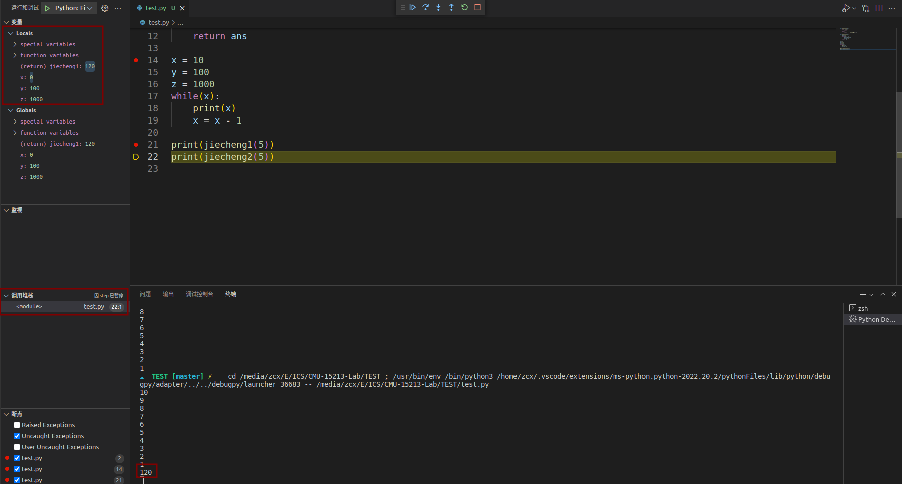

此时"jiecheng1"执行完毕，函数栈变为一个，输出了120，函数返回值为120。

### 单步跳出(shift + F11)
跳出当前函数

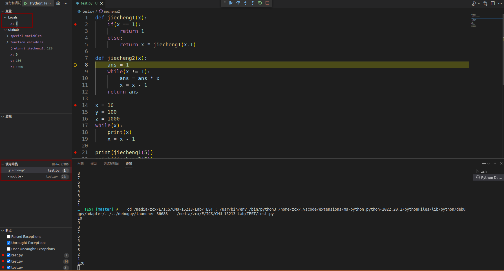

使用“单步调试(F11)”进入"jiecheng2"

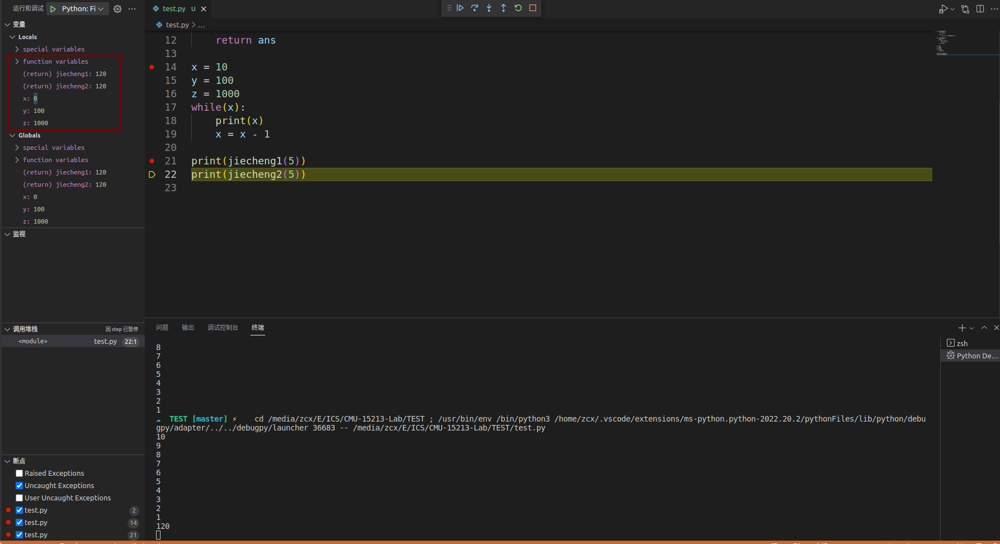

使用“单步跳出(shift + F11)”跳出"jiecheng2"，此时返回值为120，但没有print出120

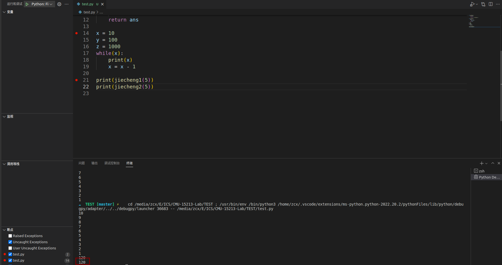
使用“单步跳过(F10)”，此时输出120，同时程序运行完毕，结束调试。

### 重启(ctrl + shift + F5)
重启调试

### 停止(shift + F5)
停止调试